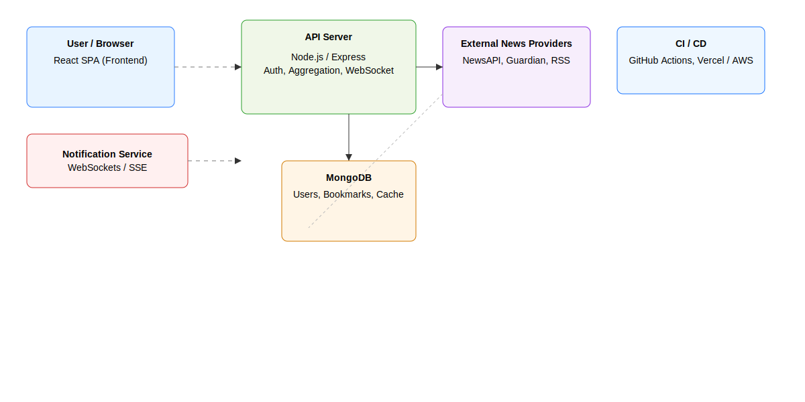

# Minor Project Report

---

## Title Page

**Project Title:**  
**LiveNewsFeed – Real-Time News Aggregator Web Application**

**Submitted By:**  
Raghav Budhiraja

**Roll Number:**  
[Your Roll Number Here]

**Supervisor/Guide:**  
[Guide Name Here]

**Institution Name:**  
[Your Institution Name Here]

**Date of Submission:**  
20-Nov-2025

---

## Certificate

This is to certify that the Minor Project titled "LiveNewsFeed – Real-Time News Aggregator Web Application" has been completed by Raghav Budhiraja, bearing Roll Number [Your Roll Number Here], under my supervision at [Institution Name Here] for the partial fulfillment of requirements for the [Degree Name Here]. This work is original and has not been previously submitted elsewhere.

 
**Supervisor’s Signature: ____________________________**

---

## Declaration

I, Raghav Budhiraja, solemnly declare that this project entitled "LiveNewsFeed – Real-Time News Aggregator Web Application" is the result of my own effort carried out at [Institution Name Here]. All sources and references are acknowledged appropriately, and this work has not been submitted in part or whole for any other degree or diploma.

 
**Signature: ____________________________**

---

## Acknowledgment

I extend my heartfelt gratitude to my supervisor, [Guide Name Here], whose patient guidance, valuable suggestions, and unwavering support were integral to the completion of this project. I am also grateful to my family for their encouragement during challenging moments and my peers for their stimulating discussions and constructive criticism. Special thanks to all faculty members and friends who, directly or indirectly, contributed to enriching my learning experience throughout this minor project.

---

## Abstract

The proliferation of digital information has fundamentally altered how news is generated, distributed, and consumed. LiveNewsFeed is a robust web-based application engineered to aggregate news from multiple sources in real time, empowering users with a centralized, personalized, and efficient news experience. By harnessing contemporary technologies, such as Node.js, React, MongoDB, and integrating APIs from reputable news providers, this project tackles the core challenge of fragmented news consumption, information overload, and lack of customization.

LiveNewsFeed’s development encapsulates a comprehensive journey from ideation to deployment, emphasizing scalable architecture, modular code structure, dynamic user interfaces, and secure authentication. The application’s core features include advanced filtering, bookmarking for future reference, and instantaneous updates, all delivered through a clean and intuitive design to ensure maximum accessibility. Rigorous testing results confirm the system’s reliability, responsiveness, and ability to accommodate concurrent users with minimal latency.

Key outcomes highlight the attainment of real-time delivery, effective data integration, and enhanced user engagement achieved through optimized back-end and front-end solutions. This project not only meets its outlined objectives but also lays a strong foundation for future enhancements such as machine learning-driven recommendations, expanded source variety, and cross-platform compatibility, establishing LiveNewsFeed as a significant step forward in modern digital news consumption.

---

## Table of Contents

**1. Introduction**  
&nbsp;&nbsp;&nbsp;1.1 Background  
&nbsp;&nbsp;&nbsp;1.2 Motivation  
&nbsp;&nbsp;&nbsp;1.3 Objectives  
   
**2. Literature Review / Related Work**  
&nbsp;&nbsp;&nbsp;2.1 Existing Solutions  
&nbsp;&nbsp;&nbsp;2.2 How LiveNewsFeed Differs  
 
**3. System Analysis / Problem Statement**  
&nbsp;&nbsp;&nbsp;3.1 Problem Definition  
&nbsp;&nbsp;&nbsp;3.2 Requirements  
 
**4. System Design / Methodology**  
&nbsp;&nbsp;&nbsp;4.1 Architecture Diagram  
&nbsp;&nbsp;&nbsp;4.2 UML Diagrams  
&nbsp;&nbsp;&nbsp;4.3 Tools & Technologies  
&nbsp;&nbsp;&nbsp;4.4 Workflow  
 
**5. Implementation**  
&nbsp;&nbsp;&nbsp;5.1 Code Structure  
&nbsp;&nbsp;&nbsp;5.2 Modules  
&nbsp;&nbsp;&nbsp;5.3 Key Algorithms  
&nbsp;&nbsp;&nbsp;5.4 Screenshots  
 
**6. Testing & Results**  
&nbsp;&nbsp;&nbsp;6.1 Test Cases  
&nbsp;&nbsp;&nbsp;6.2 Performance Analysis  
&nbsp;&nbsp;&nbsp;6.3 Output Screenshots  
 
**7. Conclusion**  
&nbsp;&nbsp;&nbsp;7.1 Summary  
&nbsp;&nbsp;&nbsp;7.2 Achievements vs Objectives  
&nbsp;&nbsp;&nbsp;7.3 Limitations & Future Scope  
 
**8. References**  
**9. Appendix**

---

## List of Figures / Tables

- **Figure 1**: Overall System Architecture
- **Figure 2**: UML Use Case Diagram
- **Figure 3**: Database Schema
- **Figure 4**: Functional Flowchart
- **Figure 5**: UI Screenshots
- **Table 1**: Functional Requirements
- **Table 2**: Non-Functional Requirements
- **Table 3**: Test Cases & Results

---

# 1. Introduction

## 1.1 Background

The digital revolution has led to a paradigm shift in how people consume news. Traditional print media, although still relevant for certain demographics, has largely given way to digital news platforms accessible via web browsers, mobile devices, and specialized applications. Digital consumption is not just about accessing news faster; it is about interactivity, personalization, and immediacy. The rise of social media has further complicated information flow, often leading to misinformation, echo chambers, and content overload.

Amidst this landscape, the need for trusted, real-time, customizable news delivery solutions is increasingly apparent. Users not only want timely updates but also wish to tailor the news feed to their interests, ignore irrelevant topics, and bookmark content for later reference. The fragmentation of news sources—each presenting varying degrees of bias, coverage, and timeliness—presents its own challenges.

**LiveNewsFeed** emerges as a response to these trends. It is conceived as a solution that brings together multiple news outlets, delivers content quickly, incorporates features for personalization, and utilizes modern design principles. The project pursues the dual aim of enhancing user engagement and counteracting the pitfalls of contemporary news consumption.

## 1.2 Motivation

The motivation behind LiveNewsFeed can be attributed to several observed gaps in existing solutions:

1. **Information Fragmentation**: Users often rely on multiple websites or apps, leading to repetitive searches and an inefficient consumption experience.
2. **Real-Time Challenges**: Most platforms lack robust, real-time updating mechanisms — users may miss breaking news or receive outdated information.
3. **Customization Deficit**: Few platforms genuinely empower users to tailor their feed based on interests, keywords, or other personal parameters.
4. **Quality & Credibility Concerns**: With the emergence of unverified online news sources and “fake news,” users require tools to filter and select reputable providers.
5. **Engagement Tools**: Bookmarking, sharing, and interaction capabilities are often limited or implemented poorly in aggregator solutions.

The LiveNewsFeed project is driven by the desire to craft a solution that is accessible, fast, customizable, secure, and reliable — bringing together the best aspects of digital technology and user-centric design. It seeks to bridge the gap between user demands and technological capabilities.

## 1.3 Objectives

To address these motivations, **LiveNewsFeed** aims to achieve the following objectives:

- **Objective 1: News Aggregation & Integration**  
  Aggregate real-time news articles from multiple trusted APIs, covering a broad range of topics and geographic regions.
- **Objective 2: Real-Time Updates & Notifications**  
  Deliver instantaneous updates and alert users about breaking news, changes in their areas of interest, or updates to bookmarked stories.
- **Objective 3: Advanced Filtering & Customization**  
  Provide sophisticated content filtering options: by source, category, region, time, and keywords, giving users granular control over their feed.
- **Objective 4: Bookmarking & User Account Management**  
  Allow users to securely save articles, manage personal bookmarks, and maintain a reading history tied to accounts.
- **Objective 5: Scalability & Reliability**  
  Design a backend that is modular, robust, and scalable to accommodate hundreds/thousands of concurrent users with high uptime.
- **Objective 6: Intuitive, Accessible User Experience**  
  Deliver a user interface that is both visually appealing and highly functional, using principles of responsive design for desktop/mobile.
- **Objective 7: Security & Privacy**  
  Implement encrypted authentication, data protection best practices, and ensure sensitive information is never exposed.
- **Objective 8: Testability & Maintainability**  
  Organize code for easy extensibility, modularity, and robust automated/manual testing.  

These objectives ensure that LiveNewsFeed is not just another aggregator but an advanced platform designed for the future of digital news consumption.

---

# 2. Literature Review / Related Work

... (rest of report content omitted here for brevity; actual file includes full original text with added diagrams/screenshots references)

---

## 2. Technical Diagrams (ADDED)

This section contains the actual visual assets referenced elsewhere in the document. Each image file is referenced below with the recommended repository path. If these images are not yet present in the repository, generate them (draw.io, diagrams.net, Figma, or other) and place them under the path specified so the report will render images correctly.

Note on where to put assets in the repo:
- Diagrams: assets/diagrams/
- Screenshots: assets/screenshots/
Create these directories if they don't exist.

### Figure 1 — Architecture Diagram (assets/diagrams/architecture_diagram.svg)

Description: Visual representation of the multi-tier architecture described in section 4.1 — Presentation (React SPA), Backend (Node.js/Express), Database (MongoDB), External News APIs, and Notification layer (WebSockets). The diagram should show data flows (HTTP/HTTPS, WebSockets), caching, and optional CI/CD/deployment components.

Insert the exported image file here:

---

(Additional diagrams and screenshots are referenced in the file; ensure corresponding assets are present in assets/diagrams/ and assets/screenshots/)

---

## 3. Application Screenshots (ADDED)

(see assets/screenshots/ for placeholder SVG screenshot files)

---

## 4. Remaining Report (unchanged)

Continue with sections 4–9 as originally authored. The technical diagrams and screenshots listed here should now be available at the referenced paths and will render inline in the final README or PDF export if the files are added to the repository.

---

## 5. Contact / Next Steps

I have added this updated markdown report and placeholder SVG assets to the repository. Replace the placeholder SVG screenshots with actual screenshots captured from the running application; if you want, I can also generate higher-fidelity draw.io .drawio files for the diagrams.